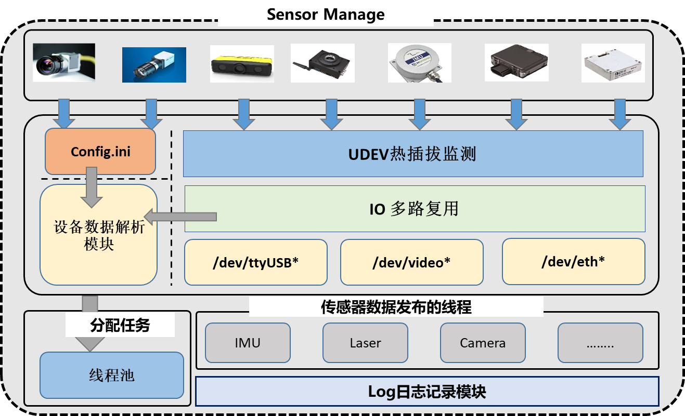

# Sensor-driven-integration
# 传感器驱动集成-中间件项目-开发文档



## 概览

 - `sensor_lib`：各类传感器的驱动动态库
 - `sensor_driver`：传感器驱动二次封装头文件，提供统一的传感器数据获取接口
 - `sensor_manage`: 基于udev的传感器即插即用模块，内部维护了一个map，存储了设备的描述信息 
 - `CMakeLists.txt`: 编译生成动态库的`CMake版本`，持续更新中
 - `Makefile`: 编译生成动态库的`Makefile`版本，持续更新中
 - `setup.bash`: 在运行测试程序前，用于指定运行时动态库搜寻路径`source setup.bash`      
 - `Dockerfile`: `docker`镜像创建文件   

`Docker`构建:

   ```bash
      <!-- 第一步构建镜像 -->
      docker build -t sensordriver .
      <!-- 第二步启动镜像 -->
      docker run -it --device=/dev/ttyUSB0 sensordriver
      <!-- 第三步编译运行 -->
   ```


编译：    
 - `Makefile`:  支持编译生成动态库和可执行的测试文件     
    ```bash
    <!-- 第一步编译生成对应动态库 -->
    make libmiddleware.so
    <!-- 第二步编译生成测试文件 -->
    make camera
    ```
    
    运行：
    ```bash
       source setup.bash
       ./camera.out
    ```
    

第三方依赖库：
 - Opencv4.6
## 姿态传感器
### LORD-MicroStrain（`3DMGX5-AHRS`）
> 官网：https://www.microstrain.com/inertial-sensors/3dm-gx5-25   
> Github：https://github.com/LORD-MicroStrain/MSCL     
> API文档：https://lord-microstrain.github.io/MSCL/Documentation/MSCL%20API%20Documentation/index.html   

  - 动态库编译了两个版本，一个为`ubuntu20.04.5`上编译，一个为`ubuntu18.04`上编译，编译时`gcc`版本不一样导致依赖存在问题，`sensor_lib`文件夹下为默认版本-20.04，`18.04`的版本在`others`文件夹下。
  - `LORD-MicroStrain`需要的boost库是官方编译的1.68.0版本，因此在编译和链接时需要手动指定头文件路径和动态库搜寻路径到`LORD-MicroStrain/c++-mscl/Boost`下。         
  - 配置信息  
    `setCurrentConfig`: 配置imu角速度和角度输出频率，指定滤波器  
    `getCurrentConfig`: 获取imu配置信息     
    `startSampling`: 开启数据读取   
    `parseData`: 解析数据并打印到终端    
    `3DMGX5-AHRS` 不支持`GNSS`模式，因此在配置文件`setCurrentConfig.h`中注释掉`GNSS`配置代码

### LPMS-IG1

> 官网：https://www.alubi.cn/lpms-ig1-series/      
> 驱动库：https://bitbucket.org/lpresearch/lpmsig1opensourcelib
## 视觉传感器

### D435

- 官方提供的SDK编译完成后会生成`librealsense2.so.2.53`和`librealsense2.so`,其中`librealsense2.so`是`librealsense2.so.2.53`的软链接

### USB相机

## 雷达

### 思岚S1

